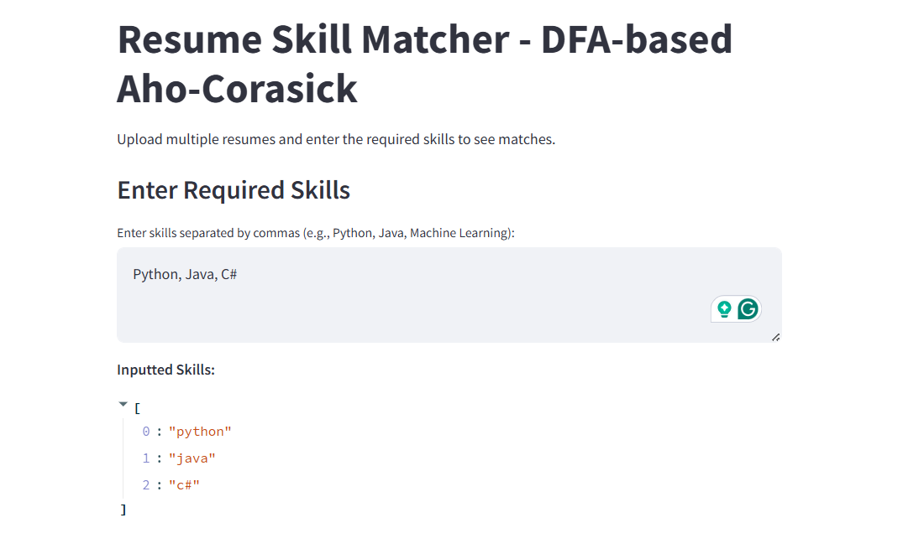
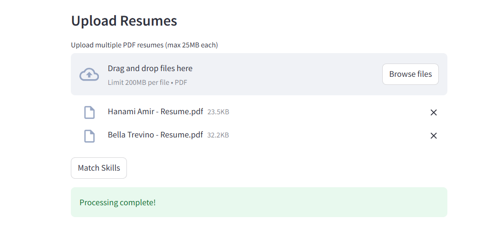
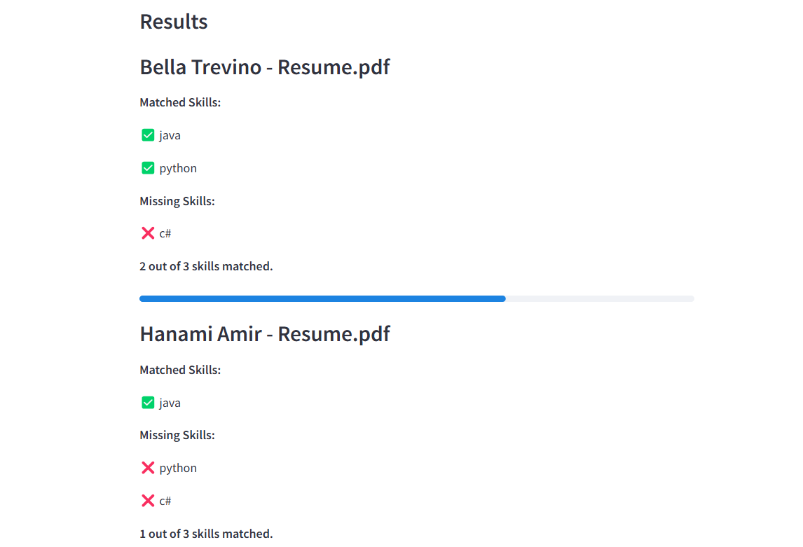

DFA-Based Approach for Skill Matching in Resume Screening

[](https://www.python.org/) [](https://streamlit.io/)

Table of Contents
- [Introduction](#introduction)
- [Features](#features)
- [Screenshots](#screenshots)
- [Installation](#installation)
- [Run Locally](#run-locally)
- [Usage Examples](#usage-examples)
- [Collaborators](#collaborators)
- [Prototype Disclaimer](#prototype-disclaimer)

This project is a prototype for the research paper titled "A DFA-Based Approach for Skill Matching in Resume Screening", which is part of our final project in COSC 302: Automata and Language Theory. The prototype automates resume screening using a Deterministic Finite Automata (DFA)-based skill-matching algorithm, implemented in Python and run via Streamlit.

The goal of this prototype is to visualize and demonstrate the practical application of DFA in resume screening, particularly for identifying and matching skills in resumes with job requirements. While this prototype serves as a guide, any lapses or limitations can be improved upon in future iterations.

## Installation
To set up the project, please follow these steps:
1. Clone the repository:
   ```bash
   git clone https://github.com/lloydlegaspi/your-repo.git
   cd your-repo
   ```
2. Install the required dependencies:
   ```bash
   pip install -r requirements.txt
   ```

## Features
- **File Upload:** Handles PDF file uploads, including multiple uploads.
- **Skill Matching:** Scans resumes and identifies required skills using a DFA-based algorithm.
- **Multi-pattern Detection:** Efficiently handles multiple skill patterns simultaneously.
- **Output Reports:** Generates a list of matched and missing skills for each resume.

## Screenshots
- Enter Skills



- Upload Resume



- View Results



## Usage Examples
To use the prototype, follow these steps:
1. Launch the application by running:
   ```bash
   streamlit run main.py
   ```
2. Upload your resume in PDF format.
3. View the output report which lists matched and missing skills.

## Run Locally
To run the prototype:
1. Navigate to the `src` folder where `main.py` is stored.
2. Run the following command:
   ```bash
   streamlit run main.py
   ```

## Collaborators
This project was developed by the following collaborators as part of their research in COSC 302: Automata and Language Theory:
- Legaspi, John Lloyd S.
- Morcillos, Kyla Franchezka L.
- Quijano, Katherine P.
- Valoria, Kyla Mae N.

## Prototype Disclaimer
This prototype is a visualization and demonstration of the research paper's concepts. It is not a fully optimized or production-ready application. Any lapses or limitations in the app/prototype can be improved upon, as this serves as a guide for further development and research.
     
